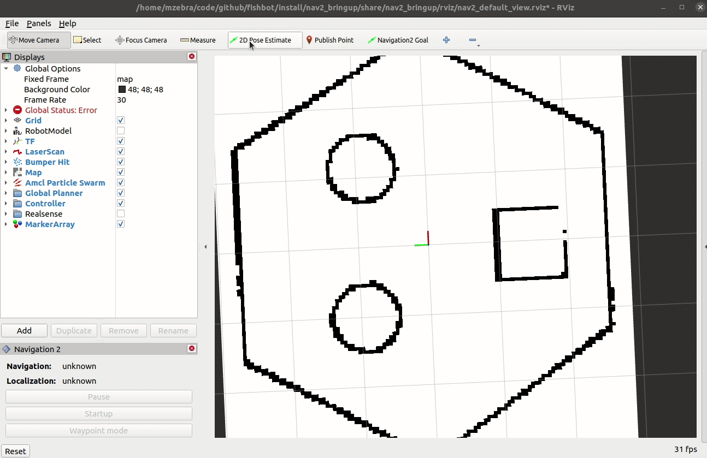
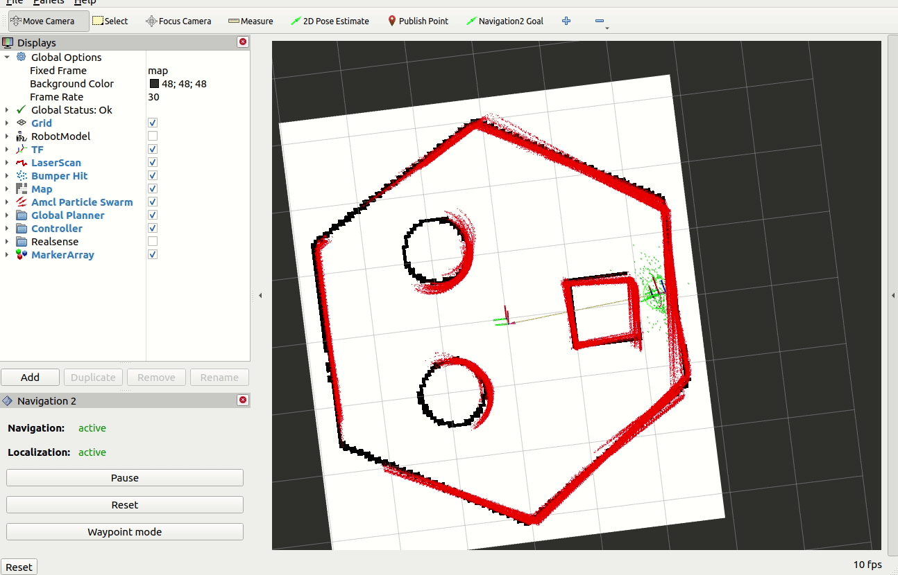

# 3.使用FishBot进行自主导航

经过前面三节的铺垫，我们只需要再编写一个launch文件启动nav2就可以让fishbot自己动起来了。

## 1.编写launch文件

我们将地图、配置文件传递给nav2为我们提供好的launch文件中即可。

> 再一个launch文件中包裹另一个功能包中的luanch文件采用的是`IncludeLaunchDescription`和`PythonLaunchDescriptionSource`

```python
'''

描述: Nav2 launch启动文件
'''
import os
from ament_index_python.packages import get_package_share_directory
from launch import LaunchDescription
from launch.actions import IncludeLaunchDescription
from launch.launch_description_sources import PythonLaunchDescriptionSource
from launch.substitutions import LaunchConfiguration
from launch_ros.actions import Node


def generate_launch_description():
    #=============================1.定位到包的地址=============================================================
    fishbot_navigation2_dir = get_package_share_directory('fishbot_navigation2')
    nav2_bringup_dir = get_package_share_directory('nav2_bringup')
    
    
    #=============================2.声明参数，获取配置文件路径===================================================
    # use_sim_time 这里要设置成true,因为gazebo是仿真环境，其时间是通过/clock话题获取，而不是系统时间
    use_sim_time = LaunchConfiguration('use_sim_time', default='true') 
    map_yaml_path = LaunchConfiguration('map',default=os.path.join(fishbot_navigation2_dir,'maps','fishbot_map.yaml'))
    nav2_param_path = LaunchConfiguration('params_file',default=os.path.join(fishbot_navigation2_dir,'param','fishbot_nav2.yaml'))
    rviz_config_dir = os.path.join(nav2_bringup_dir,'rviz','nav2_default_view.rviz')

    #=============================3.声明启动launch文件，传入：地图路径、是否使用仿真时间以及nav2参数文件==============
    nav2_bringup_launch = IncludeLaunchDescription(
            PythonLaunchDescriptionSource([nav2_bringup_dir,'/launch','/bringup_launch.py']),
            launch_arguments={
                'map': map_yaml_path,
                'use_sim_time': use_sim_time,
                'params_file': nav2_param_path}.items(),
        )
    rviz_node =  Node(
            package='rviz2',
            executable='rviz2',
            name='rviz2',
            arguments=['-d', rviz_config_dir],
            parameters=[{'use_sim_time': use_sim_time}],
            output='screen')
    
    return LaunchDescription([nav2_bringup_launch,rviz_node])
```

## 2.安装并添加依赖

### 2.1 修改CMakeLists.txt

添加install指令，将文件拷贝到install目录

```cmake
cmake_minimum_required(VERSION 3.5)
project(fishbot_navigation2)

# find dependencies
find_package(ament_cmake REQUIRED)
install(
  DIRECTORY launch param maps
  DESTINATION share/${PROJECT_NAME}
)

ament_package()
```

### 2.2 添加依赖

主要是添加这行` <exec_depend>nav2_bringup</exec_depend>`

```xml
<?xml version="1.0"?>
<?xml-model href="http://download.ros.org/schema/package_format3.xsd" schematypens="http://www.w3.org/2001/XMLSchema"?>
<package format="3">
  <name>fishbot_navigation2</name>
  <version>0.0.0</version>
  <description>TODO: Package description</description>
  <maintainer email="sangxin2014@sina.com">root</maintainer>
  <license>TODO: License declaration</license>

  <buildtool_depend>ament_cmake</buildtool_depend>

  <test_depend>ament_lint_auto</test_depend>
  <test_depend>ament_lint_common</test_depend>
  <exec_depend>nav2_bringup</exec_depend>
  <export>
    <build_type>ament_cmake</build_type>
  </export>
</package>
```

## 3.构建运行

### 3.1 构建

```shell
colcon build --packages-up-to  fishbot_navigation2
```

### 3.2 运行

#### 3.2.1 运行仿真

```
source install/setup.bash
ros2 launch fishbot_description gazebo.launch.py
```

#### 3.2.2 运行Nav2

```
source install/setup.bash
ros2 launch fishbot_navigation2 navigation2.launch.py
```

## 4.初始化位置

启动后正常你应该在RVIZ2和终端看到一个错误，这是因为没有给定初始化位置（告诉机器人它在地图的大概位置）导致的。


```shell
[planner_server-5] [INFO] [1652973621.731976741] [global_costmap.global_costmap]: Timed out waiting for transform from base_link to map to become available, tf error: Invalid frame ID "map" passed to canTransform argument target_frame - frame does not exist
[rviz2-10] [INFO] [1652973621.760971376] [rviz2]: Message Filter dropping message: frame 'odom' at time 0.000 for reason 'Unknown'
[rviz2-10] [INFO] [1652973621.856298950] [rviz2]: Message Filter dropping message: frame 'laser_link' at time 4392.881 for reason 'Unknown'
[rviz2-10] [INFO] [1652973621.951345246] [rviz2]: Message Filter dropping message: frame 'laser_link' at time 4392.981 for reason 'Unknown'
[rviz2-10] [INFO] [1652973621.951468235] [rviz2]: Message Filter dropping message: frame 'odom' at time 0.000 for reason 'Unknown'
[rviz2-10] [INFO] [1652973622.047860791] [rviz2]: Message Filter dropping message: frame 'laser_link' at time 4393.081 for reason 'Unknown'
```

通过RVIZ2的工具栏上的 `2D Pose Estimate` 可以给迷茫的fishbot指明“机生方向”。


点击 `2D Pose Estimate` ，进行姿态初始化（选中机器人在Gazebo位置差不多的点，左键点击不要松开，移动鼠标给定方向），初始化完后，左边的Global Status 就正常了。



## 5.单点导航

点击RVIZ2工具栏上的 就可以给fishbot安排一个目标点了，点击按钮，到地图上任意一点击鼠标左键，注意不要松开，移动鼠标给定一个方向。


## 6.多点（路点）导航

观察左下角，有一个Nav2的Rviz2小插件，可以进行启动停止和导航模式的切换，点击 切换到路点模式。

接着你可以使用工具栏的  按钮，给FishBot指定多个要移动的点，接着点击左下角的启动，就可以看到FishBot依次到达这些目标点。




## 7.查看机器人当前在地图中的位置

在机器人导航过程中我们如何实时查看机器人在地图中的位置呢？我们可以通过tf进行查看。

打开终端，输入指令：

```shell
ros2 run tf2_ros  tf2_echo map base_link
```

接着就可以看到下面的信息，旋转和变换位资数据了

```shell
[INFO] [1653215686.225862749] [tf2_echo]: Waiting for transform map ->  base_link: Invalid frame ID "map" passed to canTransform argument target_frame - frame does not exist
At time 4873.528000000
- Translation: [-0.009, -0.016, 0.076]
- Rotation: in Quaternion [0.000, -0.000, -0.000, 1.000]
At time 4874.514000000
- Translation: [-0.009, -0.016, 0.076]
- Rotation: in Quaternion [0.000, -0.000, -0.000, 1.000]
```

## 8.总结

本节我们终于将FishBot的自主导航给跑了起来，不过我们都是通过RVIZ2的工具给机器人指定的目标点，除了工具栏的工具，我们还可以使用代码的方式发送目标点给FishBot，下一节就会带你一起学习Nav2的API（应用程序接口）。

课后作业：

1. 使用rqt_tf_tree观察tf树的结构
2. 阅读下Nav2中文网配置指南章节内容（顺便挑几个代校准的段落进行校准）

