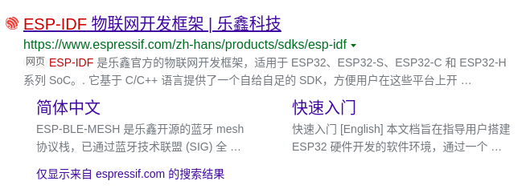

# 2.微处理器开发平台

上一节我们对单片机硬件进行了简单介绍，但单片机运行不仅仅需要硬件，类似于电脑需要配套的操作系统一样，单片机还需要与之配套的软件，本节我们学习下常见的开发平台。

我们的MicroROS板采用的单片机是ESP32芯片，该芯片支持蓝牙和WIFI并且是双核的国产芯片，用途很广，所以就介绍下该芯片的常用的几个开发平台。

## 一、官方平台-ESPIDF(ESP IoT Development FrameWork)

官网地址：https://www.espressif.com/zh-hans/products/sdks/esp-idf



所谓官方平台就是单片机的厂商，针对单片机提供的开发框架，该框架为我们提供了一个C/C++ SDK，我们通过include相应的头文件就可以实现对硬件的控制。

下面这一段是官方介绍

> ESP-IDF 是乐鑫官方的物联网开发框架，适用于 ESP32、ESP32-S、ESP32-C 和 ESP32-H 系列 SoC。它基于 C/C++ 语言提供了一个自给自足的 SDK，方便用户在这些平台上开发通用应用程序。ESP-IDF 目前已服务支持数以亿计的物联网设备，并已开发构建了多种物联网产品，例如照明、消费电子大小家电、支付终端、工控等各类物联网设备。

ESP-IDF的核心其实是基于开源的FreeRTOS优化而来的，而FreeRTOS是一个迷你（几k大小）的实时操作系统内核，所以别看它小，照样跑了个操作系统。

展示一段ESP_IDF版本的HelloWorld，感受一下

```
/*
 * SPDX-FileCopyrightText: 2010-2022 Espressif Systems (Shanghai) CO LTD
 *
 * SPDX-License-Identifier: CC0-1.0
 */

#include <stdio.h>
#include <inttypes.h>
#include "sdkconfig.h"
#include "freertos/FreeRTOS.h"
#include "freertos/task.h"

void app_main(void)
{
    printf("Hello world!\n");
    vTaskDelay(1000 / portTICK_PERIOD_MS);
    fflush(stdout);
    esp_restart();
}
```


## 二、Arduino平台

官网地址：https://www.arduino.cc/en/about


Arduino是一款便捷灵活、方便上手的开源电子原型平台，本次MicroROS学习就是基于该平台进行开发。

展示一段Arduino版本的HelloWorld代码，感受一下

```
#include <Arduino.h>
void setup() {
  // put your setup code here, to run once:
  Serial.begin(9600);
  Serial.println("Hello World!");
}

void loop() {
  // put your main code here, to run repeatedly:

}
```


## 三、MicroPython平台

官网地址：https://micropython.org/


大家都知道，人生苦短，我用Python，针对单片机平台，有没有可能使用Python开发呢？——MicroPython来了。

MicroPython是 Python 3 语言的精简实现 ，包括Python标准库的一小部分，经过优化可在微控制器和受限环境中运行。

同样的我们的MicroROS板同时也是支持使用MicroPython进行开发，只需要刷入相应的固件即可。

展示一段MicroPython的HelloWorld代码，感受下它的简单

```python
print('Hello, World!')
```


## 四、对比与总结

上面介绍了三种常见的平台，做个表格对比下三种平台的优缺点。

| 平台名称    | 优点                                                         | 缺点                                         |
| ----------- | ------------------------------------------------------------ | -------------------------------------------- |
| ESP_IDF     | 官方出品、测试完成度高、安全稳定、有官方支持、适合产品化、支持microROS | 三方教程少、工程复杂、新手不友好             |
| Arduino     | 社区庞大，教程丰富、新手友好，简单易用、支持microROS         | 封装较多                                     |
| MicroPython | Python语言、简单易用                                         | 解释执行，效率低下，封装较多，不支持microROS |

看完上面的对比，对于新手来说选择Ardunio平台容易入门且教程丰富，并且ESP32单片机是官方出品了Arduino支持（开源地址：https://github.com/espressif/arduino-esp32）。

了解完单片机开发平台，下一节我们正式搭建开发环境，然后开始编写我们的第一个HelloWorld工程！


