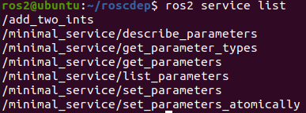

# 4.ROS2服务入门

大家好，帅鱼又蹬蹬蹬的游回来了。本节将要带大家一起了解一下什么是服务。

## 1.服务通信介绍

服务分为客户端和服务端，平时我们用的手机APP都可以成为客户端，而APP服务器对于软件来说就是服务端。

客户端发送请求给服务端，服务端可以根据客户端的请求做一些处理，然后返回结果给客户端。

```mermaid
graph 
A[服务端-李四] --发送响应-->B[客户端-李三]
B[客户端]  --发送请求--> A[服务端]
```

所以服务-客户端模型，也可以成为请求-响应模型。

> 不知道你有没有感觉到服务和话题的不同之处，话题是没有返回的，适用于单向或大量的数据传递。而服务是双向的，客户端发送请求，服务端响应请求。

同时服务还是有一些注意事项：

- 同一个服务（名称相同）有且只能有一个节点来提供
- 同一个服务可以被多个客户端调用

放两张官方形象的动图：


## 2.体验服务

在我们安装ROS2的时候其实系统为我们安装了一些样例程序，其中就有服务使用样例，我们可以先来体验一下。

### 2.1 启动服务端

打开终端，运行下面的命令，这个命令用于运行一个服务节点，这个服务的功能是将两个数字相加，给定a，b两个数，返回sum也就是ab之和。

```
ros2 run examples_rclpy_minimal_service service
```

### 2.2 使用命令查看服务列表

```
ros2 service list
```


### 2.3手动调用服务

再启动一个终端，输入下面的命令（注意a：、b：后的空格）。

```
ros2 service call /add_two_ints example_interfaces/srv/AddTwoInts "{a: 5,b: 10}"
```


我们可以看到客户端请求两个数字5+10，服务端返回15。

## 3.ROS2服务常用命令

ROS2的命令行工具，觉得还是非常值得一学的，毕竟确实很实用（装X），之前已经给大家讲过了关于节点、话题、接口相关的命令了，现在说一下关于服务的那些命令行。

### 3.1查看服务列表

```
ros2 service list
```



### 3.2手动调用服务

```
ros2 service call /add_two_ints example_interfaces/srv/AddTwoInts "{a: 5,b: 10}"
```


如果不写参数值调用会怎么样？比如下面这种，大家可以尝试下。

```
ros2 service call /add_two_ints example_interfaces/srv/AddTwoInts
```

### 3.3 查看服务接口类型

```
ros2 service type /add_two_ints
```


### 3.4查找使用某一接口的服务

这个命令看起来和3.3刚好相反。

```
ros2 service find example_interfaces/srv/AddTwoInts
```


## 4.总结

本节大家和一起又多认识了一个小伙伴，ROS2的服务。

下一节我们将学习使用RCL在节点里创建服务端和客户端。


