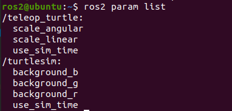
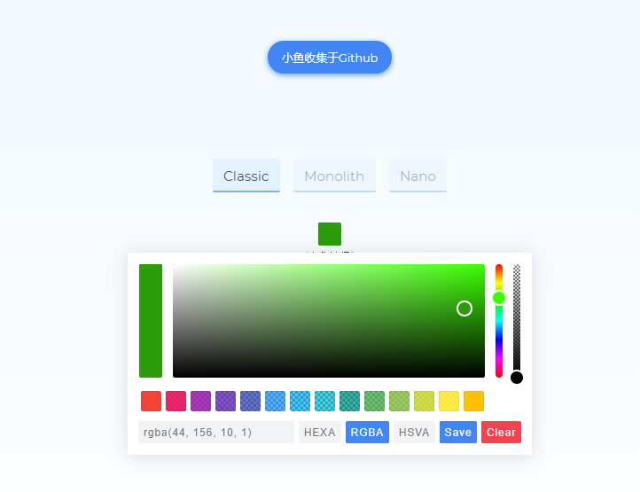
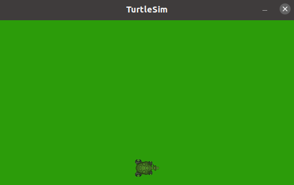

# 1.ROS2参数通信介绍

大家好，我是爱吃瓜皮的。在前面的机器人控制示例中我们，机器人每移动一步休息500ms，加入我们想让机器人休息时间少一些，就需要手动的修改源码减少其值，这非常的不方便。

在机器人开发中，会有很多参数和设置可以后期需要调整的，如果都放到源码里很难实现动态修改和管理，ROS2为了解决这一问题，提出了参数这一通信机制。

# 1.参数通信是什么？

### 1.1 参数定义

ROS2官方对参数的定义是：

**A parameter is a configuration value of a node. You can think of parameters as node settings.**

有请翻译官

**参数是节点的一个配置值，你可以认为参数是一个节点的设置**

感谢同学的精彩翻译，ROS2的参数就是节点的设置，和我们上面提出的需求不谋而合，有了参数我们就可以实现动态的改变李四写小说的速度了

### 1.2 参数组成成分

ROS2参数是由键值对组成的，此话怎讲？键值对指的是就是名字和数值，比方说

- 名字：李四写小说周期，值：5s
- 名字：显示器亮度,值：60%

名字的数据类型不多说肯定是字符串了，值的数据类型呢？我们这里用到的是5是整形数据，显然只有一个整形是不够用的，ROS2支持的参数值的类型如下：

- bool 和bool[]，布尔类型用来表示开关，比如我们可以控制雷达控制节点，开始扫描和停止扫描。
- int64 和int64[]，整形表示一个数字，含义可以自己来定义，这里我们可以用来表示李四节点写小说的周期值
- float64 和float64[]，浮点型，可以表示小数类型的参数值
- string 和string[]，字符串，可以用来表示雷达控制节点中真实雷达的ip地址
- byte[]，字节数组，这个可以用来表示图片，点云数据等信息

## 2.体验参数

我们使用乌龟模拟器来体验一下参数，同时讲解一下常用的参数的命令行工具。

### 2.1 运行小乌龟模拟器节点和小乌龟控制节点

打开终端

```
ros2 run turtlesim turtlesim_node
```

再打开一个终端

```
ros2 run turtlesim turtle_teleop_key
```

可以看到下面的蓝蓝的模拟器


### 2.2 查看节点有哪些参数（设置）

我们可以使用下面的指令来查看所有节点的参数列表，打开一个终端，运行下面的指令

```
ros2 param list
```



写代码为什么要做到见名知意?我们看到乌龟模拟器的四个参数，background背景bgr指的是blue、green、red。简而言之就是背景颜色。那这几个参数应该可以控制乌龟模拟器的背景颜色。

> 最后一个use_sim_time是每个节点都带的，后面写篇文章稍微讲讲。

如果看不懂，还可以有一个方法详细查看一个参数的信息。

```
ros2 param describe <node_name> <param_name>
```

比如：

```
ros2 param describe /turtlesim background_b
```


这里就可以详细的看到参数的名字，参数的描述，参数的类型，还有对参数的约束，最大值最小值等。

### 2.3 查看参数值

参数的组成由名字和值（键值组成），名字可以通过`param list`获取，值该使用指令获取呢？

下面这个命令行工具可以帮助我们获取参数的值

```
ros2 param get /turtlesim background_b
```

运行一下，你会发现结果是255，蓝色进度条打满，再看看r红色和g绿色。


分别是255,86,69

### 2.4 设置参数

找到了参数和值，接着我们来改变一下乌龟模拟器的颜色。

打开精心准备的在线工具：[https://fishros.com/tools/pickr](https://fishros.com/tools/pickr/)

选取一个自己喜欢的颜色，这里就选绿色，因为乌龟模拟器换成绿色的应该很奇怪。



可以看到当前的这个颜色,r为44，g为156，b为10，接着我们可以使用下面的指令来设置参数的值。

```
ros2 param set <node_name> <parameter_name> <value>
```

我们依次修改参数值：

```
ros2 param set /turtlesim background_r 44
ros2 param set /turtlesim background_g 156
ros2 param set /turtlesim background_b 10
```

接着你可以看到这样的颜色的乌龟模拟器（绿的令人发慌）


> 需要留意的是，我们修改的背景数据并没有被存储，只是临时修改。重新启动节点乌龟模拟器依然还是原来的蓝色，不是我们想要的绿色的。

### 2.5 把参数存起来

把参数存起来其实就相当去把当前的参数值拍一张快照，然后保存下来，后面可以用于恢复参数到当前的数值。

可以使用下面的命令进行操作：

```
ros2 param dump <node_name>
```

#### 2.5.1 给乌龟模拟器参数拍照

比如我们要保存乌龟模拟器的节点数据，可以采用下面的指令;

```
ros2 param dump /turtlesim
```


文件被保存成了yaml格式，用cat指令看一看

```
cat ./turtlesim.yaml
```


#### 2.5.2 恢复参数值

我们`Ctrl+C`关闭乌龟模拟器，然后再重新运行。

```
ros2 run turtlesim turtlesim_node
```


可以看到模拟器又变成了蓝色了，接着通过param的load的方法把参数值恢复成我们之前存储的。

```
ros2 param load  /turtlesim ./turtlesim.yaml
```


几乎是瞬间，乌龟模拟器又被我们搞绿了

#### 2.5.3 启动节点时加载参数快照

有什么办法一开始就让乌龟模拟器变成绿色？答案有的。

ros2 的run 指令支持下面这种`骚操作`。

```
ros2 run <package_name> <executable_name> --ros-args --params-file <file_name>
```

关闭我们的乌龟模拟器，使用下面的指令重新运行

```
ros2 run turtlesim turtlesim_node --ros-args --params-file ./turtlesim.yaml
```



可以看到一上来就时绿了的模拟器。

## 3.总结

本节带大家一起学习了参数的基本概念，同时动手把参数的命令行工具玩了一遍。

