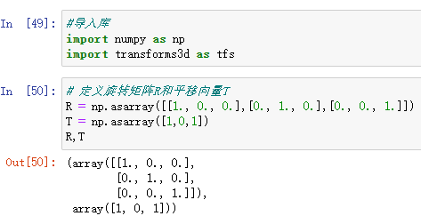
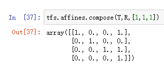
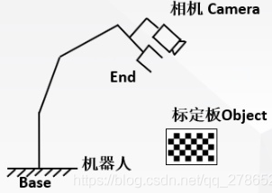

# 6.齐次坐标变换实战

上一节我们对齐次矩阵的组成和齐次矩阵的求逆和乘法两个运算的几何意义进行了介绍。

本节课我们就通过对应的函数和库实现齐次矩阵的生成，齐次矩阵的乘法和求逆。

## 1.齐次矩阵的合成与分解

齐次矩阵的的生成可以一个姿态和一个平移向量组成，因为姿态可以用四元数、欧拉角、轴角、旋转矩阵四种方式来表示

所以我们考虑先将对应的姿态转成旋转矩阵，然后使用numpy讲旋转矩阵和平移向量填写到齐次矩阵对应的位置即可

### 1.1旋转矩阵+平移向量

```
#导入库
import numpy as np
import transforms3d as tfs
```

```
# 定义旋转矩阵R和平移向量T
R = np.asarray([[1., 0., 0.],[0., 1., 0.],[0., 0., 1.]])
T = np.asarray([1,0,1])
R,T
```



#### 1.1.1 使用numpy方法合成齐次变换矩阵

```
temp = np.hstack((R,T.reshape(3,1)))
np.vstack((temp,[0,0,0,1]))
```


#### 1.1.2 使用tfs中的函数合成齐次变换矩阵

```
tfs.affines.compose(T,R,[1,1,1])
```



### 1.2四元数+平移向量

思路:先将四元数转换成旋转矩阵，然后再利用1.1合成齐次矩阵

```
R = tfs.quaternions.quat2mat([1,0,0,0])
tfs.affines.compose(T,R,[1,1,1])
```


### 1.3 练习

#### 1.3.1 练习1

已知相机坐标系{C}为参考坐标系，工具坐标系{P}的位置矢量在相机坐标系{C}`x,y,z`各轴投影为$2,1,2$，并且工具坐标系和相机坐标系姿态相同，求$^C_PT$

#### 1.3.2 练习2

已知机器人基坐标系{B}为参考坐标系，相机坐标系{C}在的位置矢量在{B}各轴的投影为$0,0,3$,坐标系{C}和绕着坐标系{B}的x轴转了180度，求$^B_CT$


## 2.齐次矩阵的分解

齐次矩阵的分解指的是已有齐次矩阵的情况下，将其分解为姿态和平移两部分

### 2.1 将qcjz分解为固定轴欧拉角和平移向量

```
tfs.euler.mat2euler(T[0:3,0:3]),T[:3,3:4]
```


### 2.3 将qcjz分解为四元数和平移向量

```
tfs.quaternions.mat2quat(T[0:3,0:3]),T[:3,3:4]
```


## 3.齐次矩阵的乘法

对应numpy中矩阵的乘法`np.dot`讲两个矩阵相乘即可，我们以一道例题来讲解这个问题。

### 3.1 练习-眼在手外

如图🔓示，已知：


1.相机坐标系{C}为参考坐标系，工具坐标系{P}的位置矢量在相机坐标系{C}`x,y,z`各轴投影为$2,1,2$，并且工具坐标系和相机坐标系姿态相同。

2.机器人基坐标系{B}为参考坐标系，相机坐标系{C}在的位置矢量在{B}各轴的投影为$0,0,3$,坐标系{C}和绕着坐标系{B}的x轴转了180度

可以参考下图看题目


求：

{B}为参考坐标系，坐标系{P}的位置矢量和旋转矩阵

解体思路也很简单，我们只要得出

- B到C的齐次变换矩阵$^B_CT$
- C到P的齐次变换矩阵$^C_PT$

得到之后将两者相乘即可得出：
$$
^B_PT=^B_CT^C_PT
$$
求出$^B_PT$我们再将其分解成位置矢量和旋转矩阵即可

动手写代码：

**先求T_BC**

```
import math
T_BC = tfs.affines.compose([0,0,3],tfs.euler.euler2mat(math.pi,0,0),[1,1,1])
T_BC
```


**再求T_CP**

```
T_CP =  T = tfs.affines.compose([2,1,2],np.identity(3),[1,1,1])
T_CP
```


**求T_BP**

```
T_BP = np.dot(T_BC,T_CP)
T_BP
```


**分解成欧拉角对比结果**

```
tfs.euler.mat2euler(T_BP[0:3,0:3]),T_BP[:3,3:4]
```


到这里我们就利用做了齐次矩阵的乘法完成了坐标的变换

## 3.齐次矩阵求逆

### 3.1练习-眼在手上



如图机器人基座坐标系为B、末端坐标系为E、相机坐标系为C、物品坐标系为O、其中相机固定在机械臂的末端。

已知
$$
^B_ET={ xyz:[0.5,0.6,0.8] ,qwqxqyqz:[1,0,0,0]} \\
^C_ET={ xyz:[0.00,0.05,0.05] ,qwqxqyqz:[0.707, 0.706, 0,0]} \\
^C_OT={ xyz:[0.00,0.02,0.85] ,qwqxqyqz:[0.877,0.479,0,0]} \\
$$
求：$^B_OT$
$$
^B_OT=^B_ET^E_CT^C_OT \\
^E_CT=^C_ET^{-1}
$$
写代码：

```
T_BE = tfs.affines.compose([0.5,0.6,0.8],tfs.quaternions.quat2mat([1,0,0,0]),[1,1,1])
T_CE = tfs.affines.compose([0.00,0.05,0.05],tfs.quaternions.quat2mat([0.707,0.706,0,0]),[1,1,1])
T_CO = tfs.affines.compose([0.00,0.02,0.85],tfs.quaternions.quat2mat([0.877,0.479,0,0]),[1,1,1])
```

```
T_EC = np.linalg.inv(T_CE)
```

```
np.dot(np.dot(T_BE,T_EC),T_CO)
```


## 4.练习

### 4.1 map坐标系转换

在移动机器人导航中，存在这样一个坐标系关系.

地图坐标系(Map)->里程计坐标系(Odom)->机器人坐标系(BaseLink)

其中里程计到机器人坐标系关系一般是由底盘轮子编码器给出，而地图坐标系和里程计坐标系之间的关系是通过定位模块估算出来的。

**所以请听题目：**

现在通过地图匹配获取到机器人在地图中的位置为[1.5,2.3,0],姿态(固定轴欧拉角)为[0,0,3.14]

查看里程计上报的机器人坐标为：位置[1.0,3.2,0] 姿态(固定轴欧拉角)[0,0,1.0]

求地图坐标系和里程计坐标系之间的关系

### 4.2 机械臂运动学正解

已知一个3自由的机械臂，已知:

- 关节1和关节2坐标关系为:[0,0,0.2] 固定轴欧拉角:[0,0,1.57]
- 关节2和关节3坐标关系为:[0.5,0,0.0] 固定轴欧拉角:[0,0,1.0]

求关节1和关节3之间的关系？


