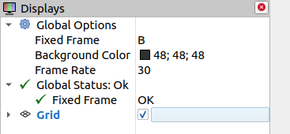
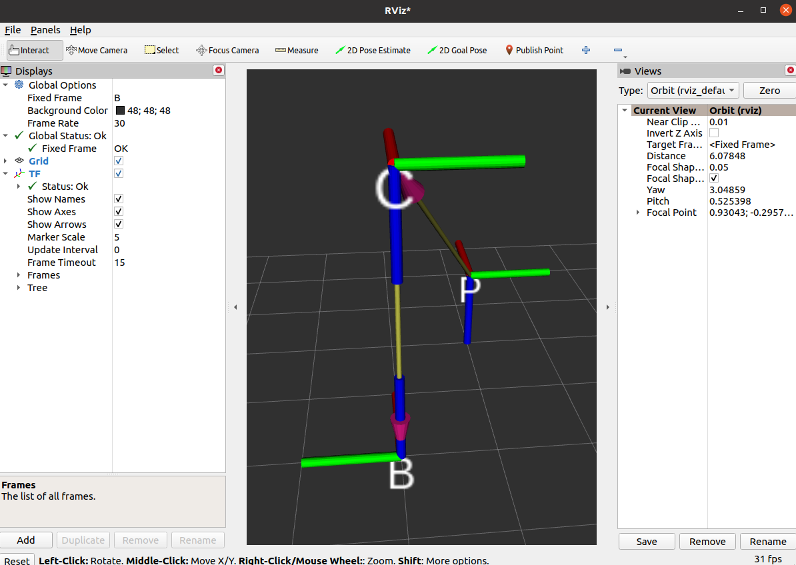

# 2.可视化坐标变换

运行上节课的示例，打开终端输入rviz2，打开rviz2，我们尝试在rviz2中直观的看到坐标之间的关系

## 1.设置默认坐标系

刚打开RVIZ2，你看到的应该是这样一个界面

我们可以看到窗口左边的配置选项，全局选项默认选择的FixedFrame为map，这个map就是rviz2默认的坐标系的名字，动动脚趾头想一下我们并没有发布map这个坐标系，所以下面Global Status也是红色的错误。

此时我们可以手动的修改以下固定的Frame为B，让默认的坐标系设置成机械臂的基坐标系{B}。

设置完成后，错误也没有了，因为此时的ROS2的TF中确确实实找到了一个叫做B的坐标系。

## 2.添加TF插件

即使没有错误，现在我们还是看不到坐标系，这是为什么呢？在的动手学ROS2课程当中，讲过，RVIZ2是一个插件化的软件，所以我们要添加TF相关的插件才能看到TF数据。 

点击左下角的Add，在弹出的窗口中选择TF点击OK

之后你在RVIZ2中就可以看到下图的坐标关系

终于显示出来了，但是没有名字又太小了，修改下左边的选项，勾选Show Names，修改Marker Scale 为5

如果觉得视角不好，可以使用鼠标左键右键以及按下滚轮拖动修改。

